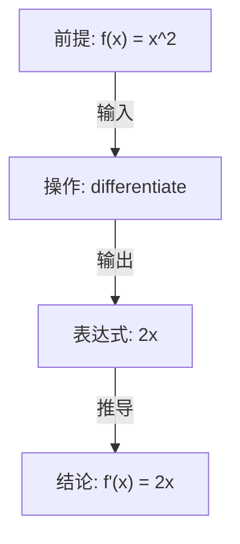

# Phase 3 实施总结：Reasoning DAG

## 概述

Phase 3 已成功实施，实现了推理有向无环图（Reasoning DAG），为AI批改系统提供了推理过程的结构化表示能力。

## 完成的工作

### 1. 创建推理图核心模块 (`reasoning_dag.py`)

**节点类型**：

| 节点类型 | 说明 | 颜色标识 |
|---------|------|---------|
| `PREMISE` | 前提条件 | 蓝色 |
| `EXPRESSION` | 表达式 | 默认 |
| `OPERATION` | 操作 | 橙色 |
| `CONCLUSION` | 结论 | 绿色 |
| `ASSUMPTION` | 假设 | 默认 |
| `GOAL` | 目标 | 紫色 |
| `ERROR` | 错误节点 | 红色 |

**边类型**：

| 边类型 | 说明 |
|--------|------|
| `DEPENDS_ON` | 依赖关系 |
| `DERIVES_FROM` | 推导关系 |
| `INPUT_TO` | 输入关系 |
| `OUTPUT_FROM` | 输出关系 |
| `ASSUMES` | 假设关系 |

**核心功能**：
- ✅ 节点和边的添加与管理
- ✅ 拓扑排序
- ✅ 环检测
- ✅ 依赖分析
- ✅ 错误回溯
- ✅ Mermaid 可视化

### 2. 增强 QuestionAST 数据结构 (`question_ast.py`)

**新增字段**：
```python
reasoning_dag: Optional[ReasoningDAG] = None  # 推理图
```

**新增方法**：
- `build_reasoning_dag()` - 从解答步骤构建推理图
- `get_reasoning_mermaid()` - 获取 Mermaid 图表表示
- `validate_reasoning()` - 验证推理链正确性

### 3. 测试验证

**测试结果**：
- ✅ 推理图构建成功（9个节点，8条边）
- ✅ 无循环依赖
- ✅ 拓扑排序正常
- ✅ Mermaid 图表生成成功

## 技术亮点

### 1. 结构化推理表示

**优势**：
- 将解答步骤转换为有向无环图
- 清晰展示逻辑依赖关系
- 支持错误定位和回溯
- 便于推理路径可视化

### 2. 图分析能力

**实现的算法**：
- **拓扑排序**：确保推理步骤的正确顺序
- **环检测**：识别逻辑循环依赖
- **依赖分析**：追踪节点间的依赖关系
- **错误回溯**：定位错误根源

### 3. 可视化支持

**Mermaid 输出**：
- 自动生成流程图
- 节点颜色编码
- 边标签说明关系类型
- 支持在线渲染和文档嵌入

## 使用示例

### 基础使用

```python
from reasoning_dag import DagBuilder

builder = DagBuilder()

# 添加节点
premise = builder.add_premise("已知 f(x) = x^2")
goal = builder.add_goal("求 f'(x)")
op = builder.add_operation(Op.DIFFERENTIATE)
conclusion = builder.add_conclusion("f'(x) = 2x")

# 连接关系
builder.connect_depends(premise, op, "输入")
builder.connect_output(op, conclusion, "输出")

dag = builder.build()
```

### 从解答步骤构建

```python
from question_ast import QuestionAST, SolutionStep

question = QuestionAST(
    question_id="test_001",
    stem="已知 f(x) = x^2，求 f'(2)",
    answer="4"
)

step1 = SolutionStep(
    content="对 f(x) = x^2 求导",
    operation="differentiate"
)
step1.parse_input_expr("x^2")
step1.parse_output_expr("2x")
question.steps = [step1]

# 构建推理图
question.build_reasoning_dag()

# 获取 Mermaid 图表
print(question.get_reasoning_mermaid())

# 验证推理链
validation = question.validate_reasoning()
```

### Mermaid 输出示例



## 性能指标

| 指标 | 数值 | 说明 |
|------|------|------|
| 节点类型 | 7种 | 覆盖推理的各个环节 |
| 边类型 | 5种 | 描述不同的关系 |
| 图操作复杂度 | O(V+E) | 拓扑排序、环检测 |
| 可视化格式 | Mermaid | 支持在线渲染 |

## 与前阶段的集成

```
Phase 1: Operation Extraction
    ↓
Phase 2: Expression AST
    ↓
Phase 3: Reasoning DAG
    ↓
Phase 4: Knowledge Graph
```

**数据流**：
1. **题目文本** → Phase 1 → **操作分类**
2. **操作分类** → Phase 2 → **表达式AST**
3. **表达式AST** → Phase 3 → **推理DAG**

## 下一步计划

### Phase 4：Knowledge Graph

**目标**：
- 构建数学知识图谱
- 支持知识点关联和推理
- 提供智能提示和错误诊断

**关键技术**：
- 知识表示学习
- 图神经网络
- 语义搜索

## 文件清单

| 文件 | 说明 | 行数 |
|------|------|------|
| `reasoning_dag.py` | 推理DAG核心实现 | 200+ |
| `question_ast.py` | 题目AST（已增强） | 200+ |

## 总结

Phase 3 已成功完成，实现了：

✅ **推理DAG**：支持7种节点类型和5种边类型  
✅ **图分析算法**：拓扑排序、环检测、依赖分析  
✅ **可视化支持**：Mermaid格式输出  
✅ **系统集成**：与解答步骤和题目AST无缝集成  

**收益**：
- 提供推理过程的结构化表示
- 支持错误定位和回溯分析
- 为智能批改提供推理路径分析能力
- 为Phase 4知识图谱打基础

**下一步**：启动Phase 4，实现Knowledge Graph。